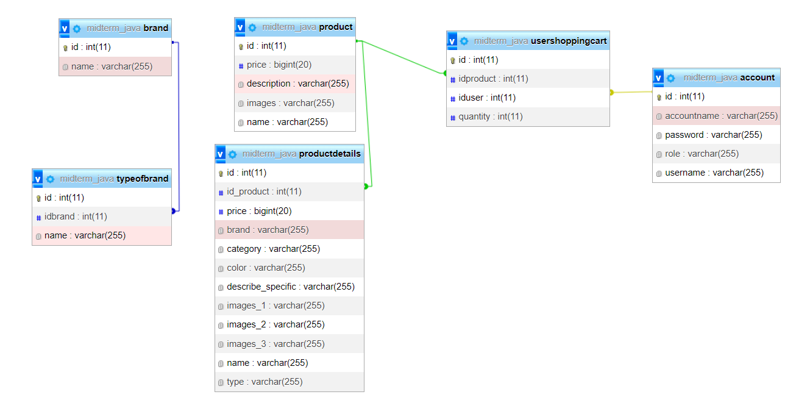
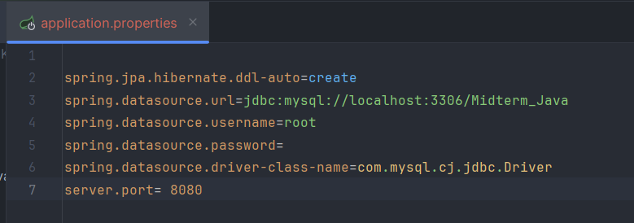
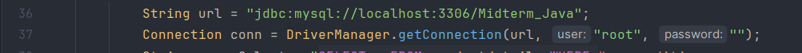
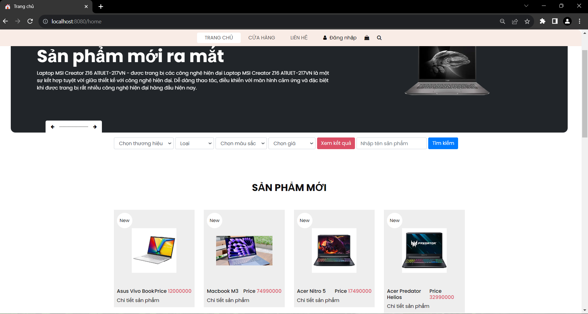

# Website
### Tóm Tắt

- [I. Mô Tả](#description)
- [II. Sơ Đồ Mối Quan Hệ Thực Thể](#ERD)
- [III. Cấu Trúc](#structure)
- [IV. Cách Chạy Dự Án](#runproject)
- [V. Sử Dụng APIs](#API-Postman)
- [VI. Demo](#demo)

## I. Mô tả 
Website bán sản phẩm đơn giản được viết bởi ngôn ngữ Java áp dụng công nghệ Spring Boot xây dựng theo mô hình MVC cho phép người dùng có thể xem được các sản phẩm được bày bán, tìm kiếm sản phẩm, lọc theo các tiêu người dùng muốn và thêm các sản phẩm vào giỏ hàng của mình. Để thêm sản phẩm vào giỏ hàng của mình người dùng cần phải đăng ký tài khoản. Website chưa hỗ trợ thanh toán trực tuyến người dùng phải thanh toán trực tiếp tại cửa hàng.

## II. Sơ đồ mối quan hệ 

## III. Cấu trúc mã 

### 1.Frontend
#### static
- `css`, `fonts`, `images`, `js`, `vendor`: Các thư mục tài nguyên tĩnh

#### templates
- `adminpage.html`, `detailsproduct.html`, `index.html`, `login.html`, `register.html`, `shopping-cart.html`, `userpage.html`: Là giao diện động các trang của Website

### 2.Backend
#### Controllers
- `AdminController.java`: Là 1 controller có mục đích xử lý các chức năng, tác vụ liên quan tới quyền hạn admin. Cụ thể ở đây là thêm, xóa, sửa các sản phẩm của Website
- `DetailsController.java`: Là 1 controller có mục đích nhận dữ liệu chi tiết của 1 sản phẩm từ Service và trả về cho trang chi tiết sản phẩm để hiện thị.
- `HomeController.java`: Là 1 controller có mục địch truyền dữ liệu sản phẩm nhận được từ Service vào cho trang chủ để hiển thị. Xử lý các chức năng: tìm kiếm sản phẩm theo tên, lọc theo các tiêu chí như là thương hiệu, giá cả, màu sắc, loại sản phẩm.
- `LoginController.java`: Là 1 controller có mục đích xử lý chức năng đăng nhập của người dùng. Xác thực và phân quyền tài khoản đăng nhập mà người dùng nhập vào. Và trả về các View tương ứng cho mỗi tài khoản.
- `ShoppingController.java`: Là 1 controller có mục đích xử lý chức năng gửi dữ liệu nhận được từ Service tới giỏ hàng của người dùng để hiện thị. Xử lý khi người dùng xóa. mua sản phẩm khỏi giỏ hàng.
- `UserpageController.java`: Là 1 controller có mục đích xử lý khi người dùng thêm sản phẩm vào giỏ hàng.

#### Data
- `Data.java`: Là 1 class trong đó có phương thức insertData() dùng để thêm dữ liệu vào cơ sở dữ liệu khi chạy chương trình.

#### Models
- `Account.java`, `Brand.java`, `Category.java`, `Product.java`, `ProductDetails.java`, `TypeOfBrand.java`, `Usershoppingcart.java`: Định nghĩa các đối tượng dữ liệu để ánh xạ vào trong cơ sở dữ liệu

#### Repository
- `AccountRepository.java`, `AdminRepository.java`, `BrandRepository.java`, `ProductDetailsRepository.java`, `ProductRepository.java`, `TypeRepository.java`, `UserShoppingRepository.java`: Là các interface được kế thừa từ lớp Interface JPARepository<T,ID> là các Spring Data JPA phục vụ truy xuất dữ liệu. Có trách nhiệm giao tiếp với Database và trả về các dạng dữ liệu mà Service yêu cầu.

#### Security
- `WebSecurity.java`: Có chức năng bảo mật đường dẫn cho trang web.

#### Service
- `AccountService.java`, `AdminService.java`, `FileUploadUtils.java`, `ProductDetailsService.java`. `ProductService.java`, `UserShoppingService.java`: Là các Service có chức năng xử lý logic theo các yêu cầu của các Controller.

#### `MidtermJavaApplication`
Class có chức năng chạy toàn bộ chương trình.

## IV. Chạy dự án trên máy tính cục bộ 

- Đầu tiên mở cửa cmd của máy tính lên, sử dụng câu lệnh "git clone [URL]" để download project về máy tính. Sau khi tải thành công sử dụng phần mềm intellij hoặc eclipse để mở Folder Midterm_Java(khuyến khích sử dụng intellij). Mở flie `application.properties` nằm trong đường dẫn `/src/main/resources` để cấu hình kết nối tới database.  thay đổi spring.datasource.url = chuỗi kết nối tới database (Khuyến nghị tạo `Database` có tên là `"Midterm_Java"` để tránh sự cố)
- Tiếp theo vào đường dẫn `src/main/java/com/example/Midterm_Java/Service` mở file có tên `ProductDetailsService.java`. Tại dòng số `36` và `37` như hình  thay đổi chuỗi kết nối `url` bằng chuỗi kết nối tới cơ sở dữ liệu của máy cá nhân. Và thay đổi tên `user` và `password` tại dòng `37`
- Khởi động `xampp` để có thể chạy được Project.
- Tiếp theo vào `src/main/java` mở file `MidtermJavaApplication.java` và khởi chạy chương trình.

- Tiếp đến mở trình duyệt web lên truy cập vào đường dẫn `localhost:8080/home` và giao diện trang chủ sẽ được hiển lên như hình ảnh 
- Từ giao diện trang chủ chúng ta có thể sử dụng các tính năng của Website mà chúng ta muốn

## V. API 

#### 1.AdminController: 
| Endpoint               | Method  | Request Body Key | Description                                        |
|------------------------|---------|------------------|----------------------------------------------------|
| /admin/{idadmin}                 | GET     | idadmin              | Trang quan lý sản phẩm của quản trị viên                              |
| /adminpage/{idadmin}/delete/{idproduct}            | GET     | idadmin, idproduct              | Thực hiện xóa sản phẩm theo `idproduct` và trả về trang quản lý sản phẩm                     |
| /adminpage/{idadmin}/insert     | POST    | Various          | Thêm sản phẩm mới theo `idproduct` từ dữ liệu được gửi từ form                   |
| /adminpage/edit/{productId}      | POST    | Various          | Cập nhật thông tin sản phẩm theo `idproduct` từ dữ liệu được gửi từ form          |

#### 2. DetailsController

| Endpoint               | Method  | Request Body Key | Description                                        |
|------------------------|---------|------------------|----------------------------------------------------|
| /details//product/{id}/{iduser}                 | GET     | id, iduser              | Trang chi tiết sản phẩm theo `id` của sản phẩm                              |

#### 3. HomeController
| Endpoint               | Method  | Request Body Key | Description                                        |
|------------------------|---------|------------------|----------------------------------------------------|
| /home                     | GET | N/A                 | Hiển trị giao diện trang chủ
| /home/filter          | GET       | Various           | Hiển thị lên trang chủ các sản phẩm được trả về theo tiêu chí lọc
| /home/search          |   GET      | searchKey      | Hiển thị các sản phẩm có tên gần giống với tên từ khóa tìm kiếm lên trang chủ

#### 4. LoginController
| Endpoint               | Method  | Request Body Key | Description                                        |
|------------------------|---------|------------------|----------------------------------------------------|
| /login                 | GET     | N/A              | Trang đăng nhập
| /logindone          | POST     | Various          | Trang chủ của người dùng nếu `role` là `user` và trang quản lý sản phẩm nếu `role` là `admin`
| /register              | GET      | N/A           |Trang đăng ký
| /register/save         | POST     | Various       |Trả về trang đăng nhập nếu đăng kí thành công

#### 5. ShoppingController

| Endpoint                  | Method  | Request Body Key | Description
|------------------------|---------|------------------|----------------------------------------------------|
|/user/shoppingcart/{userid}    | GET | userid         | Trang giỏ hàng theo `userid` người dùng|
|/homeuser/{id}                 | GET | id              | Trang chủ của người dùng
|/buyProductSuccess/{idproduct}/user/{iduser}       | GET | idproduct, iduser       | Thông báo mua sản phẩm thành công đồng thời xóa sản phẩm khỏi giỏ hàng của người dùng theo `iduser` và trả về trang giỏ hàng của người dùng|
|/deleteProduct/{idproduct}/user/{iduser}           | GET | idproduct, iduser | Xóa sản phẩm có `idproduct` khỏi giỏ hàng của người dùng theo `iduser` và hiển thị lại trang giỏ hàng của người dùng |

#### 6. UserPageController
| Endpoint                  | Method  | Request Body Key | Description
|------------------------|---------|------------------|----------------------------------------------------|
| /homeuser/{iduser} | GET | iduser | Hiển thị trang chủ của người dùng
|addproduct-to-shopping-cart/{iduser}/{idproduct} | GET | iduser, idproduct | Thêm sản phẩm vào giỏ hàng của người dùng và hiển thị lại trang chi tiết sản phẩm |

## VI. Demo 

[Bấm vào để xem video demo](https://youtu.be/GFaLsNltNkc)
